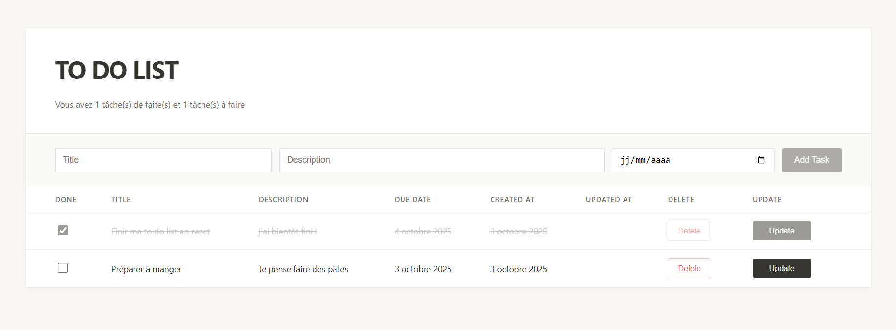

# To Do List

## 📄 Description
C'est un projet d'école, réaliser un to do list en react, pour notre initiation au framework. 
Vous pourrez y retrouver un formulaire pour créer vos task avec un titre, une description et une date de fin.
Vous pourrez ensuite les voir dans le tableau situé en dessous. Vous pouvez gérer vos tasks on les mettant comme fini,
ou alors modifier les valeurs ou supprimer une task.
Un compteur de tasks est mise en place pour permettre de voir le nombre de task accomplie ou non accomplie.

## 🛠️ Technologies Utilisées

- Typescript
- React
- CSS
- HTML
- CSS
- Git
- Github
- webstorm ( jetbrains )

## 🎥 Démo Visuelle

## ✨ Fonctionnalités

- [x] Création de tasks
- [x] Gestion des tasks (delete, edit, mark as done)
- [x] Compteur de tasks accomplies

## 🚀 Installation

### Prérequis
- Installer (Node.js, npm)

### Étapes d'installation

# Clonez le projet
git clone https://github.com/Hug0003/TodoList_React.git

# Accédez au répertoire
cd /to_do_list

## 👥 Contributeurs

- moi : - moi : [@monprofil](https://github.com/Hug0003)

### Contribuer
Les pull requests sont les bienvenues. Pour les changements majeurs, ouvrez une issue d'abord pour discuter de ce que vous souhaitez changer.

## 📬 Contact

Pour toute question, contactez-moi :
- GitHub : [@monprofil](https://github.com/Hug0003)
- E-mail : hugomeuriel@gmail.com

